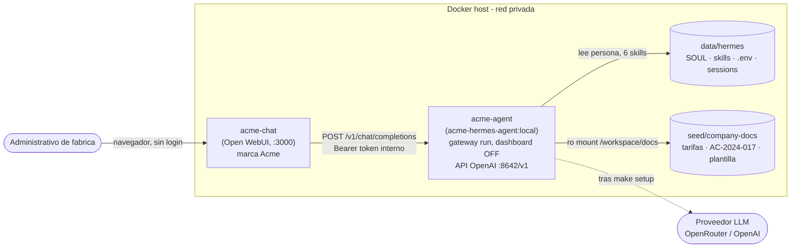

# Arquitectura — Acme Agent v3

## Resumen

El cliente (administrativos de fábrica) usa una **GUI web de chat** (`acme-chat`).
Detrás, el **agente Hermes corre headless** (`acme-agent`): sin dashboard ni
terminal expuestos, solo su API OpenAI-compatible en `:8642/v1`. La GUI habla con
el agente como si fuese un proveedor OpenAI. El agente carga persona, skills y
corpus desde el volumen sembrado.

## Decisión de GUI (G1)

Requisito: una GUI de chat OSS (no construida desde cero) para que el cliente no
use terminal. El api_server de Hermes ya expone `/v1` OpenAI-compatible y su propia
documentación lista Open WebUI, LobeChat y LibreChat como frontends válidos.

| Opción | Licencia | Login demo | Contenedores | Veredicto |
|--------|----------|------------|--------------|-----------|
| Hermes Desktop (fork) | — | — | pesado, build Linux dudoso | Descartado: pesado, no headless-friendly |
| LibreChat | MIT | requiere cuenta (sin modo anónimo) | api + MongoDB (+opc.) | Buen white-label legal, pero sin "sin login" y multi-contenedor |
| **Open WebUI** | BSD-3 + cláusula de marca | **`WEBUI_AUTH=false` = sin login** | **1 (SQLite integrado)** | **Elegido**: demo sin login, un contenedor, wiring OpenAI por env |
| Otro OSS | — | — | — | No claramente mejor |

**Elegido: Open WebUI.** Razones: (1) `WEBUI_AUTH=false` da demo LAN sin login, requisito duro; (2) un solo contenedor → fiabilidad en despliegue desatendido; (3) wiring trivial al endpoint OpenAI del agente vía `OPENAI_API_BASE_URL`; (4) el scan automático de G3 (`hermes|nous`) pasa porque la GUI no contiene esas cadenas. **Tradeoff de licencia**: la licencia de Open WebUI exige conservar la atribución del proyecto salvo ≤50 usuarios o licencia enterprise. Para este mock (≤50) es válido y rebrandeamos el nombre visible con `WEBUI_NAME`. Para retirar el 100% de la marca a escala: licencia enterprise de Open WebUI o migrar a LibreChat (MIT). Ver `CLIENT-PACK.md`.

## Componentes

### `acme-agent` (backend)

- **Imagen:** `acme-hermes-agent:local` (fork de parche, ver `Dockerfile` / G2).
- **Comando:** `gateway run`.
- **Dashboard:** **desactivado** (`HERMES_DASHBOARD=0`) — el cliente nunca ve la TUI/xterm upstream.
- **API:** `:8642/v1` OpenAI-compatible, `API_SERVER_KEY` interno, modelo anunciado `acme-agent` (`API_SERVER_MODEL_NAME`).

### `acme-chat` (GUI cliente)

- **Imagen:** `ghcr.io/open-webui/open-webui:main`.
- **Puerto:** `:3000` (host) → `8080` (contenedor).
- **Sin login:** `WEBUI_AUTH=false`. **Marca:** `WEBUI_NAME=Acme Maquinaria Especial`.
- **Backend:** `OPENAI_API_BASE_URL=http://acme-agent:8642/v1`.

### Volúmenes

| Host | Contenedor | Modo | Contenido |
|------|-----------|------|-----------|
| `./data/hermes` | `/opt/data` (acme-agent) | rw | SOUL, 6 skills, config, `.env`, sessions, marcador `.no-bundled-skills` |
| `./seed/company-docs` | `/workspace/docs` (acme-agent) | ro | tarifas, AC-2024-017, plantilla v3 |
| `./data/open-webui` | `/app/backend/data` (acme-chat) | rw | estado de la GUI (SQLite, gitignored) |

### Frontera de secretos

| Ubicación | ¿Secretos? |
|-----------|-----------|
| Repo git | Nunca |
| `seed/` | Nunca |
| `API_SERVER_KEY` en compose | Token interno LAN (no es key de LLM); rotar en prod |
| `./data/hermes/.env` | Sí — API key del modelo tras `make setup` |

## Flujo RFQ (demo)

1. El admin abre `http://localhost:3000` (sin login) y escribe la RFQ en el chat web.
2. Open WebUI envía `POST /v1/chat/completions` al agente con el modelo `acme-agent`.
3. El agente carga SOUL/skills desde `/opt/data` y lee `/workspace/docs/*` (tarifas, AC-2024-017, plantilla v3).
4. Devuelve un **BORRADOR** con margen ≥ 18 % y cita de proyecto análogo (requiere LLM configurado por `make setup`).

## No-objetivos (v3)

- Sin RAG/CAD/ERP. Sin multi-tenant. Sin envío automático a cliente (gobernanza BORRADOR en `seed/SOUL.md`).

## Referencias

- [Hermes Agent](https://github.com/NousResearch/hermes-agent) · [Docker](https://hermes-agent.nousresearch.com/docs/user-guide/docker) · [Open WebUI](https://github.com/open-webui/open-webui)
