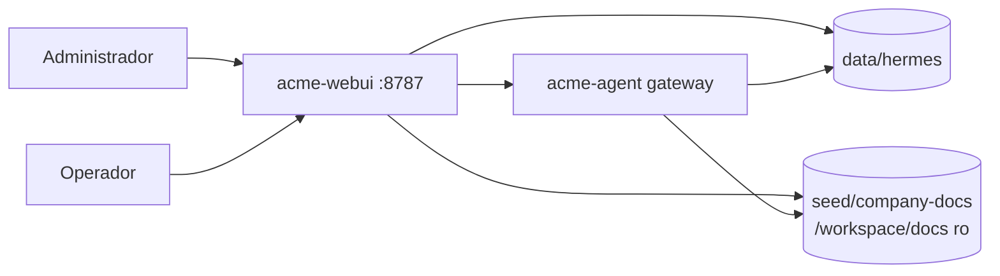

# Arquitectura — Acme Agent v5

## Stack

```yaml
services:
  acme-agent:
    role: Hermes gateway headless
    port: 8642
    dashboard: off
  acme-webui:
    role: UI cliente industrial + RBAC
    port: 8787
shared_volume: ./data/hermes
docs_workspace: /workspace/docs
locale: es-ES
theme: acme-industrial
```



## Contrato AcmeUiSurface

```yaml
AcmeUiRole:
  - admin
  - usuario

AcmeUiSurface:
  locale: es-ES
  theme: acme-industrial
  rail_visible:
    admin: [chat, workspaces, skills, memory, tasks, kanban, todos, profiles, logs, insights, settings]
    usuario: [chat, workspaces]
  settings_sections:
    admin: [conversation, appearance, preferences, providers, plugins, system, help]
    usuario: []
```

Fuente versionada: `seed/acme-ui-config.yaml`.

## Login demo

El fork `acme-webui` activa auth demo con:

```yaml
ACME_UI_DEMO_LOGIN: "1"
ACME_ADMIN_USERNAME: "admin"
ACME_ADMIN_PASSWORD: "acme-admin-demo"
ACME_USER_USERNAME: "operador"
ACME_USER_PASSWORD: "acme-user-demo"
```

Las credenciales son demo local, no producción.

## RBAC

### Frontend

`scripts/patch-webui-acme.sh` inyecta:

- `data-acme-role` antes de paint.
- Locale `es` / `es-ES` antes de paint.
- Skin `acme-industrial`.
- Mapa `ACME_ROLE_PANELS`.
- Guard en `switchPanel()`.
- Ocultación CSS de superficies de operador.

### Backend

El mismo patch modifica el backend del fork:

- Sesión con metadata `{role, username, expires}`.
- `/api/auth/status` devuelve `acme_role`.
- Usuario recibe `GET /api/workspaces` reducido a `/workspace/docs`.
- Usuario recibe `403` en:
  - settings mutables
  - logs
  - providers/model admin
  - profiles
  - plugins
  - skills mutation
  - workspace mutation
  - file write/upload
  - dashboard/shutdown

Admin conserva acceso completo.

## Tema industrial

Fuente: `docker/webui/acme-industrial.css`, copiada a `static/acme-industrial.css` en build.

Tokens principales:

| Token | Valor |
|---|---|
| `--acme-bg` | `#1a1f26` |
| `--acme-surface` | `#232a33` |
| `--acme-border` | `#3d4a57` |
| `--acme-text` | `#e2e8f0` |
| `--acme-muted` | `#94a3b8` |
| `--acme-accent` | `#f59e0b` |
| `--acme-primary` | `#2563eb` |

Restricciones:

- Dark only.
- Radio máximo 4px.
- Sin sombras difusas.
- Rail 56px.
- Tool cards con borde izquierdo ámbar.
- Selector de tema/skin oculto.
- Dashboard Hermes externo oculto.

## Build the Lever

`docker/webui/Dockerfile` clona upstream `nesquena/hermes-webui` en el pin v4 y ejecuta:

```bash
scripts/patch-webui-acme.sh /src
```

Ese script llama primero a `patch-webui-branding.sh` y después aplica:

1. Auth demo multiusuario.
2. RBAC backend.
3. RBAC frontend.
4. Español visible.
5. Tema industrial.
6. Asserts de build.

## Verificación

```bash
./scripts/verify-branding.sh
./scripts/verify-spanish.sh
```

Los scripts hacen login admin, descargan HTML/JS/CSS servidos y fallan si detectan marca upstream o inglés visible crítico.
