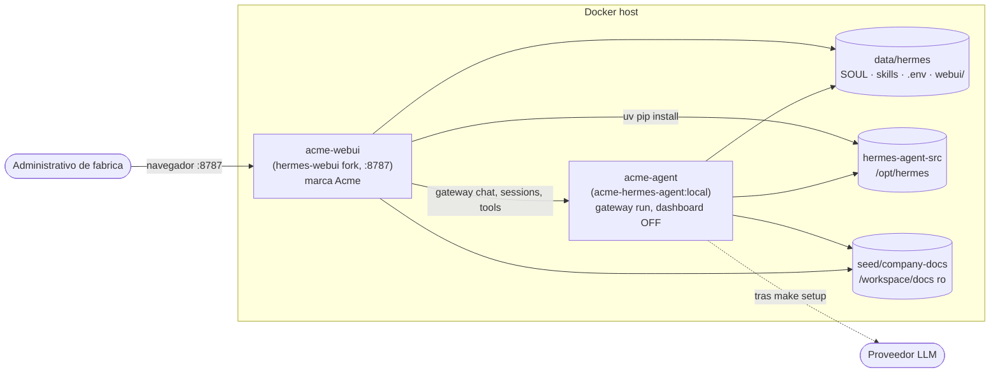

# Arquitectura — Acme Agent v4

## StackState (data shape)

```yaml
hermes_home: ./data/hermes          # config, sessions, skills, .env (shared)
webui_state: ./data/hermes/webui    # HERMES_WEBUI_STATE_DIR (inside home)
workspace: /workspace/docs          # seed/company-docs bind mount (ro)
agent_image: acme-hermes-agent:local
webui_image: acme-hermes-webui:local
```

**Services**

| Service | Role | Notes |
|---------|------|-------|
| `acme-agent` | Hermes gateway | `gateway run`, `HERMES_DASHBOARD=0`, API `:8642` debug only |
| `acme-webui` | Agent-native GUI | `:8787`, `HERMES_WEBUI_HOST=0.0.0.0`, demo auth off |

Shared contract: both containers bind `./data/hermes` (agent at `/opt/data`, webui at `/home/hermeswebui/.hermes`). Named volume `hermes-agent-src` shares `/opt/hermes` from the agent image for webui dependency install.

## Resumen

El cliente usa **Hermes WebUI** (`acme-webui`), una GUI de agente con sesiones, tool cards, workspace browser y skills nativos. El **agente Hermes** (`acme-agent`) corre headless como gateway. Ya no hay shim OpenAI como superficie principal ni Open WebUI.



## Decisión de GUI: Open WebUI (v3) → Hermes WebUI (v4)

Requisito del product owner: UI de **agente**, no chatbot genérico sobre `/v1/chat/completions`.

| Criterio | Open WebUI (v3) | Hermes WebUI (v4) |
|----------|-----------------|-------------------|
| Modelo mental | Chatbot OSS (modelos, conversaciones) | Agente Hermes (sesiones, tools, workspace, skills) |
| Tool cards | No nativos (texto plano vía OpenAI shim) | Nativos en stream markdown |
| Sesiones Hermes | No | Sí (historial, lineage, export) |
| Workspace / docs | No | Browser integrado |
| Skills panel | No | Sí |
| Licencia white-label | BSD-3 + cláusula marca (≤50 usuarios) | MIT (fork `hermes-webui-acme`) |
| Residuos de marca | `<title>Open WebUI</title>`, modal novedades OSS | Parcheable al 100% vía fork + script |
| Wiring | `OPENAI_API_BASE_URL` oculta capacidades | Gateway nativo compartiendo `HERMES_HOME` |
| Contenedores | 1 GUI + 1 agente | 2 (patrón upstream `docker-compose.two-container.yml`) |

**Elegido v4: fork MIT de [nesquena/hermes-webui](https://github.com/nesquena/hermes-webui)** (`felipebasurto/hermes-webui-acme`). Principio **Experience First**: el administrativo ve sesiones, herramientas y workspace como en el agente, no un chat genérico. Principio **Subtract Before You Add**: Open WebUI y `data/open-webui/` se eliminan antes de añadir `acme-webui`.

Puerto cliente documentado: **`:8787`** (default upstream).

## Componentes

### `acme-agent` (backend)

- **Imagen:** `acme-hermes-agent:local` (`Dockerfile` raíz).
- **Comando:** `gateway run`.
- **Env:** `HERMES_HOME=/opt/data`, `HERMES_DASHBOARD=0`, `API_SERVER_KEY` interno.
- **Volúmenes:** `./data/hermes` → `/opt/data`; `hermes-agent-src` → `/opt/hermes`.

### `acme-webui` (GUI cliente)

- **Imagen:** `acme-hermes-webui:local` (`docker/webui/Dockerfile`).
- **Puerto:** `:8787`.
- **Env:** `HERMES_WEBUI_STATE_DIR=/home/hermeswebui/.hermes/webui`, demo sin password.
- **Volúmenes:** `./data/hermes` → `/home/hermeswebui/.hermes`; `hermes-agent-src` → `.../hermes-agent:ro`; `./seed/company-docs` → `/workspace/docs:ro`.

### Frontera de secretos

| Ubicación | ¿Secretos? |
|-----------|-----------|
| Repo git | Nunca |
| `API_SERVER_KEY` en compose | Token interno LAN; rotar en prod |
| `./data/hermes/.env` | Sí — API key del modelo tras `make setup` |

Principio **Boundary Discipline**: agente (gateway, tools, LLM) vs webui (presentación). Contrato compartido: solo el volumen `data/hermes` y `hermes-agent-src`.

## Flujo RFQ (demo)

1. Admin abre `http://localhost:8787`, nueva sesión.
2. Pega RFQ de `seed/company-docs/rfq/ejemplo-entrada-001.txt`.
3. El agente carga SOUL + 6 skills desde `data/hermes` y lee `/workspace/docs/*`.
4. Respuesta esperada: **BORRADOR** con AC-2024-017, plantilla v3, margen ≥ 18 % (requiere LLM en `.env`).

## Throughput checkpoint (v4 migration)

| Dimensión | Plan |
|-----------|------|
| **Blocking first steps** | SUBTASK A docs → B fork build → C compose (stack must build before branding/e2e) |
| **Independent workstreams** | B (Dockerfile + patch script) ∥ prep of C compose YAML after A; D verify script after B image exists; E skills anytime before F |
| **Shared mutable state** | `./data/hermes` serialized via seed script; `API_SERVER_KEY` sync in `scripts/seed-volume.sh` (Encode Lessons in Structure); `hermes-agent-src` volume single-writer at first `up` |
| **Smallest safe decomposition** | A doc → B image → C compose → D verify → E skills → F e2e → G docs/handoff; one atomic commit per subtask |

## Ficheros a parchear en fork hermes-webui (branding Acme)

Script: `scripts/patch-webui-branding.sh` (idempotente). Targets principales:

| Path | Cadenas / acción |
|------|------------------|
| `static/index.html` | `<title>`, `appTitlebarTitle`, placeholders, onboarding title, dashboard labels |
| `static/manifest.json` | `name`, `short_name`, `description` |
| `static/i18n.js` | Claves `onboarding_title`, `settings_*`, strings "Hermes Web UI" |
| `static/panels.js` | `bot_name` default, help links `nousresearch.com`, alert titles |
| `static/ui.js` | `assistantDisplayName`, heartbeat alert, `_botName` fallback |
| `static/onboarding.js` | Copy "Hermes" en flujos OAuth |
| `static/sw.js` | Offline message |
| `static/sessions.js` | Title regex `Hermes WebUI` |
| `static/style.css` | Comentarios skin "Nous Research" (tema industrial Acme) |
| `api/config.py`, `api/auth.py`, `api/onboarding.py` | Defaults server-side `bot_name`, login page |
| `static/favicon*`, `apple-touch-icon*`, `manifest.json` icons | Reemplazar con logo Acme |

**Forbidden en UI servida:** `hermes`, `nous`, `nousresearch`, `Hermes Web`, `Hermes Control`, `Open WebUI` (case-insensitive en HTML/JS estático servido).

**Preservar:** identificadores funcionales (`X-Hermes-CSRF-Token`, `HermesAssistantTurnAnchors`, rutas API `/api/*`) — no romper runtime.

## Referencias

- [Hermes Agent](https://github.com/NousResearch/hermes-agent)
- [Hermes WebUI upstream](https://github.com/nesquena/hermes-webui) — pin `dc90ec9be4f2691a60d2413350405f2758a340a2`
- [Acme fork](https://github.com/felipebasurto/hermes-webui-acme) (MIT)
